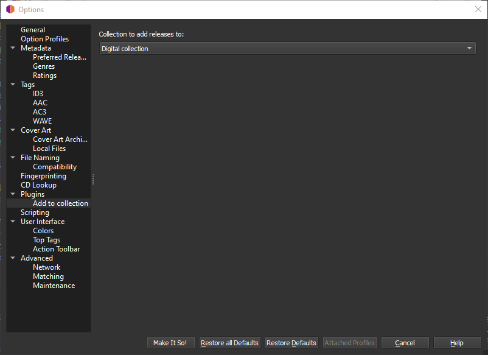

# Add to Collection

This plugin allows you to add any saved release to one of your user release [collections](https://musicbrainz.org/doc/Collections).

Download [here](https://picard.musicbrainz.org/api/v2/download?id=add_to_collection).

---

The plugin adds a settings page under the "Plugins" section under "Options..." from Picard's main menu that lets you choose
the collection you want to add the releases to

