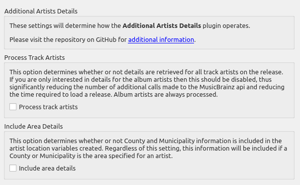

# Additional Artists Details

## Overview

This plugin provides specialized album and track variables with artist details such as type, gender, begin and end dates, location (begin, end and current) and country code (begin, end and current) for use in tagging and naming scripts.

***NOTE:*** This plugin makes additional calls to the MusicBrainz website api for the information, which will slow down retrieving album information from MusicBrainz.  This will be particularly noticable when there are many different album or track artists, such as on a \[Various Artists\] release.  There is an option to disable track artist processing, which can significantly increase the processing speed if you are only interested in album artist details.

---

## Option Settings

The plugin adds a settings page under the "Plugins" section under "Options..." from Picard's main menu.  This allows you to control how the plugin operates with respect to processing track artists and detail included in the artist location variables' content.



---

## What it Does

This plugin reads the album and track metadata provided to Picard, extracts the list of associated artists, retrieves the detailed information from the MusicBrainz website, and exposes the information in a number of additional variables for use in Picard scripts.

### Variables Created

* **\_artist_\{artist_id\}_begin** - The begin date (birth date) of the artist
* **\_artist_\{artist_id\}_begin_country** - The begin two-character country code of the artist
* **\_artist_\{artist_id\}_begin_location** - The begin location of the artist
* **\_artist_\{artist_id\}_country** - The two-character country code for the artist
* **\_artist_\{artist_id\}_disambiguation** - The disambiguation information for the artist
* **\_artist_\{artist_id\}_end** - The end date (death date) of the artist
* **\_artist_\{artist_id\}_end_country** - The end two-character country code of the artist
* **\_artist_\{artist_id\}_end_location** - The end location of the artist
* **\_artist_\{artist_id\}_gender** - The gender of the artist
* **\_artist_\{artist_id\}_name** - The name of the artist
* **\_artist_\{artist_id\}_sort_name** - The sort name of the artist
* **\_artist_\{artist_id\}_type** - The type of artist (person, group, etc.)

A variable will only be created if the information is returned from MusicBrainz.  For example, if a gender has not been specified in the MusicBrainz data then the **%\_artist_\{artist_id\}_gender%** variable will not be created.

---

## Example

If you load the release **Wrecking Ball** (release [8c759d7a-2ade-4201-abc2-a2a7c1a6ad6c](https://musicbrainz.org/release/8c759d7a-2ade-4201-abc2-a2a7c1a6ad6c)) by Sarah Blackwood (artist [af7e5ea9-bd58-4346-8f78-d672e9f297f7](https://musicbrainz.org/artist/af7e5ea9-bd58-4346-8f78-d672e9f297f7)), Jenni Pleau (artist [07fa21a9-c253-4ed0-b711-d63f7965b723](https://musicbrainz.org/artist/07fa21a9-c253-4ed0-b711-d63f7965b723)) & Emily Bones (artist [541d331c-f041-4895-b8f2-7db9e27dc5ab](https://musicbrainz.org/artist/541d331c-f041-4895-b8f2-7db9e27dc5ab)), the following variables will be created:

Sarah Blackwood (primary artist):

* **\_artist_af7e5ea9_bd58_4346_8f78_d672e9f297f7_begin** = "1980-10-18"
* **\_artist_af7e5ea9_bd58_4346_8f78_d672e9f297f7_begin_country** = "CA"
* **\_artist_af7e5ea9_bd58_4346_8f78_d672e9f297f7_begin_location** = "Burlington, Ontario, Canada"
* **\_artist_af7e5ea9_bd58_4346_8f78_d672e9f297f7_country** = "CA"
* **\_artist_af7e5ea9_bd58_4346_8f78_d672e9f297f7_disambiguation** = "rockabilly, + "Somebody That I Used to Know""
* **\_artist_af7e5ea9_bd58_4346_8f78_d672e9f297f7_gender** = "Female"
* **\_artist_af7e5ea9_bd58_4346_8f78_d672e9f297f7_location** = "Canada"
* **\_artist_af7e5ea9_bd58_4346_8f78_d672e9f297f7_name** = "Sarah Blackwood"
* **\_artist_af7e5ea9_bd58_4346_8f78_d672e9f297f7_sort_name** = "Blackwood, Sarah"
* **\_artist_af7e5ea9_bd58_4346_8f78_d672e9f297f7_type** = "Person"

Jenny Pleau (additional artist)

* **\_artist_07fa21a9_c253_4ed0_b711_d63f7965b723_country** = "CA"
* **\_artist_07fa21a9_c253_4ed0_b711_d63f7965b723_gender** = "Female"
* **\_artist_07fa21a9_c253_4ed0_b711_d63f7965b723_location** = "Kitchener, Ontario, Canada"
* **\_artist_07fa21a9_c253_4ed0_b711_d63f7965b723_name** = "Jenni Pleau"
* **\_artist_07fa21a9_c253_4ed0_b711_d63f7965b723_sort_name** = "Pleau, Jenni"
* **\_artist_07fa21a9_c253_4ed0_b711_d63f7965b723_type** = "Person"

Emily Bones (additional artist)

* **\_artist_541d331c_f041_4895_b8f2_7db9e27dc5ab_gender** = "Female"
* **\_artist_541d331c_f041_4895_b8f2_7db9e27dc5ab_name** = "Emily Bones"
* **\_artist_541d331c_f041_4895_b8f2_7db9e27dc5ab_sort_name** = "Bones, Emily"
* **\_artist_541d331c_f041_4895_b8f2_7db9e27dc5ab_type** = "Person"

Note that variables will only be created for information that exists for the artist's record.

This could be used to set a **%country%** tag to the country code of the (primary) album artist with a tagging script like:

```taggerscript
$set(_tmp,_artist_$getmulti(%musicbrainz_albumartistid%,0)_)
$set(country,$if2($get(%_tmp%country),$get(%_tmp%begin_country),$get(%_tmp%end_country),xx))
```
