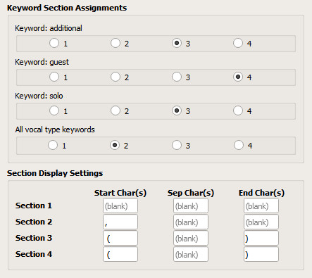

# Format Performer Tags \[[Download](https://github.com/rdswift/picard-plugins/raw/2.0_RDS_Plugins/plugins/format_performer_tags/format_performer_tags.zip)\]

## Overview

This plugin allows the user to configure the way that instrument and vocal performer tags are written. Once
installed a settings page will be added to Picard's options, which is where the plugin is configured.

---

## What it Does

This plugin serves two purposes.
 
### First:
 
Picard will by default try to order the performer/instrument credits by the name of the performers, summing up all instruments for that performer in one line.
This plugin will order the performer/instrument credits by instrument, summing up all performers that play them.
 
So instead of this:

``` 
background vocals and drums: Wayne Gretzky
bass and background vocals: Leslie Nielsen
guitar, keyboard and synthesizer: Edward Hopper
guitar and vocals: Vladimir Nabokov
keyboard and lead vocals: Bianca Castafiore
```

It will be displayed like this:

``` 
background vocals: Wayne Gretzky, Leslie Nielsen
bass: Leslie Nielsen
drums: Wayne Gretzky
guitar: Edward Hopper, Vladimir Nabokov
keyboard: Edward Hopper, Bianca Castafiore
lead vocals: Bianca Castafiore
synthesizer: Edward Hopper
vocals: Vladimir Nabokov
```
 
### Second:
 
This plugin allows fine-tuned organization of how instruments, performers and additional descriptions (keywords) are displayed in the instrument/performer tags.
 
Here is some background information about these keywords:
 
MusicBrainz' database allows to add and store keywords (attributes) that will refine or additionally describe the role of a performer for a recording.
For an artist performing music on an instrument, these are the three attributes (keywords) that MusicBrainz can store, and offer Picard:
 
* additional
* guest
* solo
 
For an artist performing with his/her voice, MusicBrainz has this restricted list of keywords describing the role or the register of the voice:
 
* background vocals
* choir vocals
* lead vocals
  * alto vocals
  * baritone vocals
  * bass vocals
  * bass-baritone vocals
  * contralto vocals
  * countertenor vocals
  * mezzo-soprano vocals
  * soprano vocals
  * tenor vocals
  * treble vocals
* other vocals
  * spoken vocals

 
Picard can retrieve and display these keywords and will list them all together in front of the performer.
The result will be something like this:

```
guitar and solo guitar: Bob 'Swift' Fingers
additional drums: Rob Reiner (guest)
additional baritone vocals: Hermann Rorschach
guest soprano vocals: Bianca Castafiore
```

The problem with this is that it is a bit indistinct if these keywords say something about the instrument, the artist and their performing role, the voice's register, or the persons relation to the group/orchestra.
For instance:
 
* 'additional' is referring to instrumentation. For example 'additional percussion'.
* 'guest' is referring to the performer as a person. Indicating that they are a guest in that band/orchestra instead of a regular member.
* 'solo' is referring to a specific role a musician performs in a composition. For example a musician performing a guitar solo.
* 'soprano vocals' is saying something about the register of a performer's voice.
 
So you might want to attach 'solo' to the instrument, 'baritone' to the vocals, and 'guest' to the performer.
This plugin allows you to do that, so you could have something like this as a result:

```
guitar [solo]: Bob 'Swift' Fingers
drums ‹additional› : Rob Reiner (guest)
vocals, baritone ‹additional› : Hermann Rorschach
vocals, soprano: Bianca Castafiore (guest)
```

---

## How it Works

This is the concept behind the workings of this plugin:
 
The basic structure of a performer tag such as Picard produces it is:

    [Keywords] Instrument / Vocals: Performer
 
This plugin makes four different 'Sections' at fixed positions in these tags available.
Their positions are:

    [Section 1]Instrument / Vocals[Section 2][Section 3]: Performer[Section 4]
 
In the settings panel you can define in what section (at what location) you want each of the available keywords to be displayed.
You can do that by simply selecting the section number for that (group of) keyword(s).
 
You can also define what characters you want to use for delimiting or surrounding the keywords.
For some situations you might want to use the more common parenthesis brackets ( ), or maybe you prefer less common brackets such as \[ \] or ‹ ›.
Note that using default parenthesis might confuse possible subsequent tagging formulas in the music player/manager of your choice. 
You can also just leave them blank, or use commas, spaces, etc.
 
Note that the plugin does not add any spaces as separators by default, so you will need to define those to your personal liking.
 
---

## Settings

The first group of settings is the **Keyword Section Assignments**.  This is where you select the section in
which each of the keywords will be displayed.  Selection is made by clicking the radio button corresponding
to the desired section for each of the keywords.

The second group of settings is the **Section Display Settings**.  This is where you configure the text
included at the beginning and end of each section displayed, and the characters used to separate multiple
items within a section.  Note that leading or trailing spaces must be included in the settings and will not
be automatically added.  If no separator characters are entered, the items will be automatically separated
by a single space.

The initial default settings are:

<!---
```
Keyword 'additional':  Section 3
Keyword 'guest':       Section 4
Keyword 'solo':        Section 3
All 'vocals' keywords: Section 2

Section 1 starting text:   ''
Section 1 ending text:     ''
Section 1 separator text:  ''

Section 2 starting text:   ', '
Section 2 ending text:     ''
Section 2 separator text:  ''

Section 3 starting text:   ' ('
Section 3 ending text:     ''
Section 3 separator text:  ')'

Section 4 starting text:   ' ('
Section 4 ending text:     ''
Section 4 separator text:  ')'
```
--->


These settings will produce tags such as:

```
rhodes piano (solo): Billy Preston (guest)
percussion: Steve Berlin (guest), Kris MacFarlane, Séan McCann
vocals, background: Jeen (guest)
```

---

## Examples

The following are some examples using actual information from MusicBrainz:

### Example 1:

(add example)

### Example 2:

(add example)

### Example 3:

(add example)

---

## Credits

Special thank-you to [hiccup](https://musicbrainz.org/user/hiccup) for improvement suggestions and extensive testing during
the development of this plugin, and for providing the write-up and examples that formed the basis for this User Guide.


<!---
## Description

This plugin allows the user to configure the way that instrument and vocal performer tags are written. Once
installed a settings page will be added to Picard's options, which is where the plugin is configured.

These settings will determine the format for any Performer tags prepared. The format is divided into six
parts: the performer; the instrument or vocals; and four user selectable sections for the extra
information. This is set out as:

\[Section 1\]Instrument/Vocals\[Section 2\]\[Section 3\]: Performer\[Section 4\]

You can select the section in which each of the extra information words appears.  These extra information
words are "additional", "guest", "solo" and type of vocal.

For each of the sections you can select the starting character(s), the character(s) separating entries, and
the ending character(s).  Note that leading or trailing spaces must be included in the settings and will not
be automatically added.  If no separator characters are entered, the items will be automatically separated
by a single space.

Note that sections that don't contain any entries for a givien performer tag will not be included in the
tag, including any start or end text configured for the section.

For example, some of the ways that a performer relationship for Billy Preston playing a guest solo on the
Rhodes piano could be configured to be saved include:

* Performer [guest solo rhodes piano]: Billy Preston
* Performer [solo rhodes piano]: Billy Preston (guest)
* Performer [rhodes piano]: Billy Preston (guest solo)
* Performer [rhodes piano, guest solo]: Billy Preston
* Performer [rhodes piano, solo]: Billy Preston (guest)
* Performer [rhodes piano, guest]: Billy Preston (solo)

This shows only a few examples of the many possible displays that can be configured.

## Settings

The first group of settings is the **Keyword Section Assignments**.  This is where you select the section in
which each of the keywords will be displayed.  Selection is made by clicking the radio button corresponding
to the desired section for each of the keywords.

The second group of settings is the **Section Display Settings**.  This is where you configure the text
included at the beginning and end of each section displayed, and the characters used to separate multiple
items within a section.  Note that leading or trailing spaces must be included in the settings and will not
be automatically added.  If no separator characters are entered, the items will be automatically separated
by a single space.

The initial default settings are:

```
Keyword 'additional':  Section 3
Keyword 'guest':       Section 4
Keyword 'solo':        Section 3
All 'vocals' keywords: Section 2

Section 1 starting text:   ''
Section 1 ending text:     ''
Section 1 separator text:  ''

Section 2 starting text:   ', '
Section 2 ending text:     ''
Section 2 separator text:  ''

Section 3 starting text:   ' ('
Section 3 ending text:     ''
Section 3 separator text:  ')'

Section 4 starting text:   ' ('
Section 4 ending text:     ''
Section 4 separator text:  ')'
```

These settings will produce tags such as:

* Performer [rhodes piano (solo)]: Billy Preston (guest)
* Performer [percussion]: Steve Berlin (guest), Kris MacFarlane, Séan McCann
* Performer [vocal, background]: Jeen (guest)

--->
