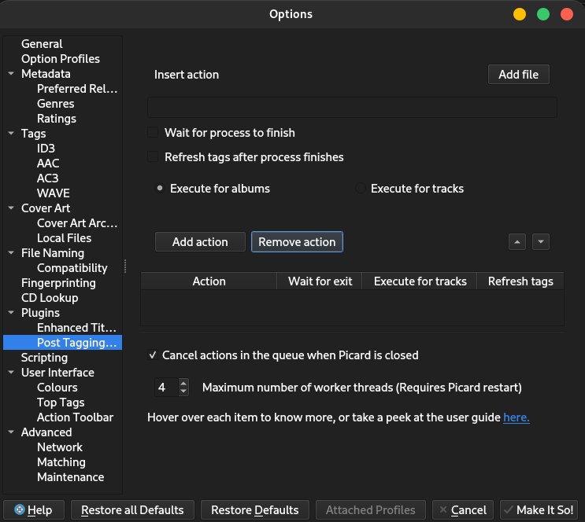

# Post Tagging Actions
This plugin lets you set up actions that run with a context menu click.
An action consists in a command line executed for each album or each track along with a few options to tweak the behaviour. This can be used to run external programs and pass some variables to it. Environment variables do not work.

To run the actions,
- First move the albums or tracks you are interested in to the right hand pane.
- Then highlight all the items you want the actions to run for.
- Right click, go to plugins, then click "Run Actions for highlighted albums/tracks".
### Adding an action
In the options page, you will find "Post Tagging Actions" under "Plugins". You will be greeted by this:



1. Enter the command to run in the text box, choose your options, then click "Add action".
2. You can click on "Add file" to search for a file and add its path to the text box.
3. Once you add an action, it will appear in the table at the bottom of the page. You can reorder actions with the arrows above the table.
## Options
- `Wait for process to finish` will make the next command in the queue execute only after this one has finished.
- `Refresh tags after process finishes` will reload the files once the command finishes. This is useful when an external program changes files' tags.
- `Execute for albums/tracks` lets you choose whether the command will be executed once for each track or each album highlighted.

The order of the actions in the table represents the order of execution: the top most action will be executed first.
## Variables
You can use variables in the commands just like in scripting. For example: 
```
python /path/script.py --album %album% --artist %albumartist%
```
The variables `%album%` and `%albumartist%` will be replaced with their value for each album.

For actions that execute once per album, only variables in the album's metadata can be used. Same thing for actions that execute once per track, only variables in the track's metadata can be used.
### Special variables
There are also extra variables that can be used.

The following are used to get files' information: 
- `%filepath%`: The full path of the file.
- `%folderpath%`: The path of the folder in which the file is located.
- `%filename%`: The name of the file, without the extension.
- `%filename_ext%`: The name of the file, with the extension.
- `%directory%`: The name of the folder in which the file is located.

When these are used with album actions,  the first file found is considered. For example, if you keep all tracks in the same folder, using `%folderpath%` will give you the path to that folder.

The following apply to each album:
- `%gen_num_matched_tracks%`: The number of tracks which have a matching file.
- `%gen_num_unmatched_tracks%`: The number of tracks without any matching files.
- `%gen_num_total_files%`: The number of files added.
- `%gen_num_unsaed_files%`: The number of files that have unsaved changes.
- `%is_complete%`: "True" if every track is matched, "False" otherwise. (Shown with a gold disc in Picard)
- `%is_modified%`: "True" if the album has some changes to apply, "False" otherwise. (Shown with a red star on the disc)

When these are used with track actions, the album to which the track belongs to is considered.

